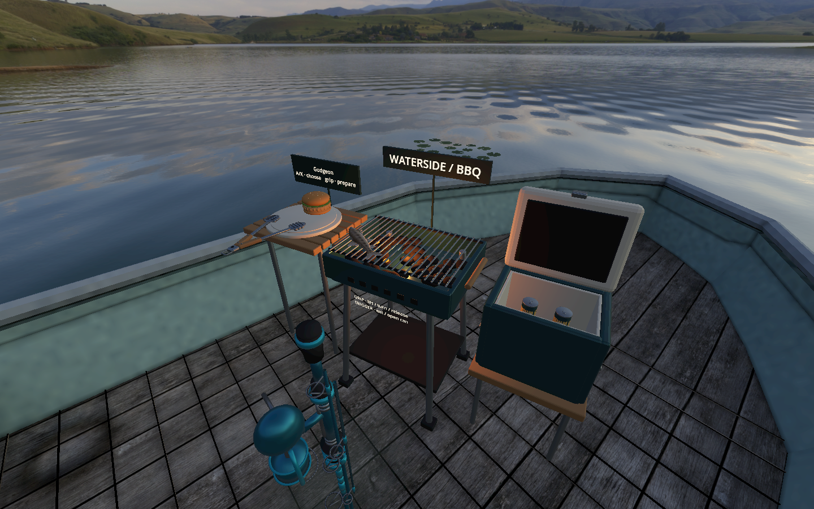

# Waterside BBQ

Open the menu's **BBQ** page and choose **Start / finish BBQ here**, or press **B** on desktop. Finish a cast and release a landed fish first. The rod is stowed for the cookout and restored when it ends.

The prep menu offers fish burgers and species recorded in the catch journal **at the current location**. A species caught elsewhere does not unlock it here; records without a location are excluded. These are repeatable recipes, not deductions from the catch journal. No sausages, corn, mushrooms, or other food types are offered. Up to four food portions can be prepared at once.

## Motion controllers

- **A/X:** select the next local fish or fish burger; grip near the prep sign to prepare it.
- **Grip food:** pick it up with either hand. It retains its pose relative to that hand.
- **Turn your wrist and release above the grate:** put the other side against the grill. Each side browns independently, develops grill marks, and eventually chars. Lifting food pauses cooking.
- **Tongs:** grip the wooden handles at the front of the prep board with either hand. Hold that hand's trigger to clamp fish or a burger at the tips, turn your wrist, then release the trigger above the grate. The food changes sides with your physical motion; the trigger never flips or eats it. Release grip to dock the tongs. Bringing clamped food to your mouth eats the food while keeping the tool in hand.
- **Eat:** bring held food to your mouth, or press the trigger on the hand holding it. Picking it up and waiting never eats it. The opposite hand cannot consume it.
- **Cooler:** trigger near the lid to open or close it, then grip a can inside. Four cans start hidden in the closed cooler.
- **Beer:** the first holding-hand trigger opens the can with a tab snap and carbonation hiss. Bring the opened can to your mouth, or press that trigger again, to drink it. A sealed can cannot be drunk at the face. Grip release returns the can to the cooler.
- The right menu button remains available. Tracking/focus loss safely returns held items without consuming them; a new grip press is required after tracking returns. VR locomotion remains available around the station.

## Desktop

**B** start/finish; middle-mouse drag to look; **E** pick up the food/can/tongs under your view or put it down; **F** turn held food over; **Up/Down** move it farther/closer; **Enter** eat/open/drink; **C** open/close cooler; **N** select food; **P** prepare. With tongs held, hold **Enter** to clamp food, use **F** to turn the tool, and release **Enter** to put the food down.

## Assets and implementation

`tools/build_bbq.py` generates original Blender meshes in metres and exports material-grouped GLBs: a charcoal grill, ash-wood prep area, serving plate, insulated cooler with ice, hinged lid, lager can, and sesame fish burger. `tools/build_bbq_tongs.py` adds stainless spring tongs with ash grips, scalloped jaws, rivets and a hanging loop. The jaw mesh is instanced on opposing animated pivots. `source/bbq_quality.blend` retains the editable assets and assembled preview. Existing credited fish models supply the caught species. `tools/build_bbq_audio.py` generates original can-opening and grill-sizzle sounds.

The jaws open vertically with opposing gripping faces, close to the food's thickness, and reopen on trigger release.

The activity is local; BBQ food, cooler state, and cooking are not replicated to other multiplayer clients.

## Verification

Run `python3 tools/test_vr_fixes.py bbq bbq_controllers rod_holster menu_controls` with isolated test saves. The BBQ suites cover 157 assertions, including location filtering, both cooking sides, actual synthetic XRControllerTracker inputs through the game callbacks, both hands, jaw orientation and trigger animation, consumption, the hidden cooler, opening audio, and focus loss. Repeated start/stop checks verify exactly one pair of tongs, a return to the prep board, and no visible BBQ meshes after exiting with either hand holding the tool. The lid geometry test follows the exported front edge through 20 opening positions: it lifts above the rim and moves toward the fixed rear hinge, finally clearing the interior behind it. Menu and holster regression suites pass.

Blender MCP verified the generated meshes. Godot MCP launched the game and captured the station in the Mobile/Vulkan renderer with OpenXR active. Synthetic controller checks and rendered inspection do not establish physical headset reach comfort or sustained performance; those still need hands-on acceptance.
