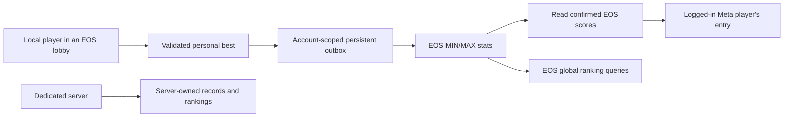

# EOS source and Meta leaderboard mirror

Prepared on `experimental/eos-meta`. Disabled by default. EOS and Meta definitions are
provisioned. EOS is verified with live SDK reads; no leaderboard scores were submitted.

Dedicated servers continue to own `--leaderboard-path` / `user://server/leaderboard.json`.
Their fishing totals, golf records, persistence, requested ranking pages and UI
stay independent. ENet sessions do not collect or submit cloud scores. Existing
server history is never imported into EOS or Meta.



## Prepared functionality

- Eight versioned, non-expiring boards: heaviest catch (integer grams), longest catch
  (integer millimetres), and lowest completed 18-hole score for each of six golf
  courses. Fishing stores kg/cm internally; conversion happens once at the cloud
  boundary. Ingest values must fit positive signed int32, the narrower EOS range.
- Only EOS lobby play collects new local personal bests. Fishing uses the existing
  cast/fight/landing validation; golf accepts a completed, non-retired 18-hole card
  with no forfeited holes. These are **client-attested testing scores**, not a
  trusted anti-cheat or competition authority.
- The outbox is separate from server records. Its filename hashes the schema,
  product, sandbox, deployment, EOS PUID, Meta application ID and Meta viewer ID. It retains pending
  scores across crashes, writes atomically and preserves corrupt files for recovery.
- EOS ingests use absolute values with MIN/MAX aggregation. A timeout can safely
  retry the same best score. A success callback alone never clears a pending
  score: a subsequent EOS query must show that score or a better one.
- Meta receives only values returned by a successful EOS stats query. It writes
  the authenticated viewer's entry with `force_update=false` and no extra identity
  payload, rechecking the SDK viewer before each write. Meta failures do not resend
  already-confirmed EOS ingests. Each login
  reconciles Meta again, including EOS scores earned on another linked device.
- Healthy synchronization runs at most once per minute, using one batched ingest
  and one batched score query, with at most two Meta writes per pass. Failures back
  off to five minutes; mirror jobs rotate so a failing board cannot starve others.
  Queries and writes are serialized within the service. No gameplay RPC or pose
  payload was added.
- `session.online.leaderboards.query_page(key, page)` prepares the EOS rankings
  API: ten rows per page, pages 0–4, a one-minute cache and a five-second query
  throttle. Rows omit PUIDs; `rank` preserves the native EOS value and `position`
  is the one-based list position. The existing rankings panel remains server-only;
  adding an explicit Online/Server view is a subsequent UI step.
- Leaving/changing sessions invalidates pending completions. Provider calls bind
  to the authenticated account and reject identity changes. SDK work remains on
  the main thread and never blocks frame processing while awaiting a callback.

Meta is a **per-viewer mirror**, not a second global identity directory. PC-only
players appear in EOS; their Meta entry can synchronize when that same linked EOS
account signs in on Quest. Never merge identities by display name. The current
PC device-login path remains a development identity, not production account linking.

## Provisioning and activation

Use [EOS_LEADERBOARDS.example.json](EOS_LEADERBOARDS.example.json) as the exact
provisioning specification. It is a review template, not an automatic portal importer.

1. In the intended EOS deployment, create all eight named stats with the indicated
   **stat aggregation**, then all eight leaderboards with the matching IDs, stats,
   aggregation and v1 window: start `1790330760` (2026-09-25 10:06 UTC), end `-1`
   (never expires). The portal requires a start date; `-1` is a query wildcard,
   not the start stored by its creation form. No v1 scores predate this window.
   Do not use SUM or LATEST, or substitute a later start date for this namespace.
   Grant the game's EOS client policy self-stat ingest, stat query and leaderboard
   query access. The adapter checks leaderboard definitions before its first
   write, but the Stats API does not expose the underlying stat aggregation: verify
   that setting in the portal as well.
2. In the matching Meta application, create each exact API name with numeric
   scores (Meta Point type), Client Authoritative entry writes, and application
   access limited to Ultimate Boomer Simulator. Keep User facing and friend
   notifications off during testing. Fishing sorts higher-first; golf sorts
   lower-first. Verify entitlement and applicable platform data access with test users.
   Incorrect sort order breaks keep-best semantics and must be fixed before enabling.
3. Confirm Meta-to-EOS identity linking on entitled Quest accounts. No upload app
   secret belongs in the client, outbox or leaderboard entries.
4. In the local `eos.cfg`, add:

   ```ini
   [leaderboards]
   enabled=true
   ```

   The Android EOS exporter explicitly carries this boolean into the APK. Missing
   means false; strings such as `"true"` are rejected. Desktop development uses
   the same setting with its existing explicit test-identity flag.
5. Validate in a test deployment: submit a new best, query EOS until visible, check
   Meta ordering/score, restart with an interrupted upload, test a Meta outage,
   switch account, and confirm dedicated-server play never changes either cloud
   board. Query propagation can delay mirroring across multiple passes.

The versioned board namespace is intentional. An administrative score reduction,
ban, deletion or season reset is not propagated by keep-best writes. A new season
needs a new namespace; moderation/corrections need a trusted reconciliation path.
Do not enable production boards until those policies and on-device behavior are tested.

## Cumulative categories: next integration stage

`catches`, `earned`, `exceptional`, golf rounds and forfeits remain server-local.
Publishing the maximum of server totals would lose catches across servers;
retrying SUM increments after an ambiguous timeout would duplicate catches.

Prepare a trusted event aggregator before enabling those global categories:

- Accept authenticated events with stable event IDs and verified EOS actor IDs.
  Award values are derived by the authority, never taken from client balances.
- Deduplicate on `(deployment, actor, event_id)` in a durable event ledger.
  Atomically update the actor's aggregate and an export outbox in one transaction.
- Export **absolute aggregate snapshots** to EOS MAX stats; retries remain
  idempotent. Serialize/reconcile per actor and handle the EOS int32 ceiling.
  The existing client should only read these EOS totals and mirror its own entry.
- Do not automatically enlist dedicated servers or upload their historical files.
  Keep their local rankings independent; any future event producer is a separate,
  explicitly configured trust boundary.

This preparation supplies SDK adapters, lifecycle hooks, a durable best-score
outbox, a bounded reader and failure tests. It does not deploy an event backend
or replace the ranking UI. Portal and live validation status is recorded below.

## Portal setup, 2026-09-25

Configured through official Playwright MCP 0.0.82 attached to an isolated Vivaldi
profile, with interactive developer authentication.

- EOS product `eecd2ee94fed409886609b4cf4fd627d`, sandbox
  `a9fbe66fd8ea474a9d77b9fa3d51a809`, deployment
  `c72d48d53f314430a5905ebca435ed02` (Live Deployment): all eight stats and
  [leaderboards](https://dev.epicgames.com/portal/pldot/products/ubs/epic-online-services/leaderboards/Live/c72d48d53f314430a5905ebca435ed02)
  created and read back with the specified names, aggregations and time window.
- Existing UBS Peer2Peer client policy already grants `findLeaderboardDefinitions`,
  `findLeaderboardEntries`, stats reads (including `findStatsForAnyUser`) and
  `ingestForLocalUser`. No policy changes were needed.
- Live desktop SDK probe verified all eight definitions, a personal stats query
  and a ranking query. Both score results were empty; no scores were written.
- Meta application `3428825797290213` (Ultimate Boomer Simulator): all eight
  [mirror boards](https://developers.meta.com/horizon/manage/applications/3428825797290213/platform-services/leaderboards/)
  created. Read-back confirms numeric Point scores, Client Authoritative writes,
  the matching application and Higher/Lower is Better sorting. All have zero
  entries; User facing and friend notifications are off.
- Version `0.1.18-eos.2` (23) opts into synchronization in the local ALPHA export
  configuration for Quest testing. The checked-in default stays disabled.
  Quest score submission, Meta mirroring and account-switch acceptance remain
  unverified on hardware; these are experimental client-attested scores.

## Validation

`tests/online_leaderboards.gd` covers encoding, MIN/MAX retries, delayed EOS
visibility, Meta-only retries, account isolation, corruption, bounded/fair writes,
cache limits, cancellation, completed golf cards, fishing collection and native
API shapes. `tests/test_eos_android_export.py` checks the opt-in export setting.
Existing server leaderboard, ranking-page, EOS lifecycle and dedicated-server
restart/reconnect tests protect the independent server path.

`tests/online_leaderboards_live.gd` is an explicit live, read-only leaderboard
probe. It authenticates a desktop test device (creating its EOS identity if needed)
but never creates a lobby, ingests a score or calls Meta. Run with an isolated
`XDG_DATA_HOME`, `--headless --xr-mode off --path . --script
tests/online_leaderboards_live.gd -- --eos-device-test --eos-config <local cfg>
--result <report.json>`. Keep the configuration and SDK logs private.

## SDK references

- [Epic Stats interface](https://dev.epicgames.com/docs/epic-online-services/player-and-game-data/stats-interface)
- [Epic Leaderboards interface](https://dev.epicgames.com/docs/epic-online-services/player-and-game-data/leaderboards-interface)
- [Pinned EOSG stats binding](https://github.com/3ddelano/epic-online-services-godot/blob/56238973e2cd7ac9ac99ca14f88934465f0a8997/src/stats_interface.cpp)
- [Pinned Meta toolkit leaderboard methods](https://github.com/godot-sdk-integrations/godot-meta-toolkit/blob/7fc223fa4b9a1b43552a53bf287a720c4719ea76/doc_classes/MetaPlatformSDK.xml)
