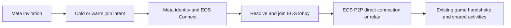

# EOS transport with Meta social services on Quest

Research date: 2026-09-24. Code inspected: production `main` at `555e9fc`.
This is a feasibility assessment, not an installed integration or a live EOS
service test. No headset software was installed or launched for this assessment.

## Recommendation

**Proceed with a contained prototype of EOS Connect + Lobbies + P2P, using
Meta for Quest identity, presence and invitations.** Keep ENet available for
LAN and dedicated servers. Preserve the existing host-authoritative game rules.

EOS offers the missing Internet connection layer (NAT traversal and relay),
while Meta offers the expected headset social experience. This is a plausible
route to player-hosted crossplay without manual port forwarding. It is not a
plug-in replacement: both reviewed Godot transport implementations have packet
size and delivery-mode incompatibilities with this game's current traffic.

| Responsibility | Proposed provider | Integration status |
|---|---|---|
| Quest entitlement and logged-in identity | Meta Platform SDK | Entitlement already integrated; identity/proof methods are bundled |
| Session membership and discovery | EOS Lobbies | New integration |
| Internet game packets and relay fallback | EOS P2P | New transport adapter needed |
| Quest invitations, presence and join intents | Meta Group Presence / Destinations | SDK bindings available; application flow not implemented |
| Game state, golf rules and BBQ ownership | Existing game host | Reuse |
| LAN and dedicated-server transport | Existing ENet peer | Retain |
| Proximity/radio voice | Existing Opus path initially | Reuse over EOS adapter; assess EOS RTC separately |

Epic provides an Android SDK and supports engines other than Unreal. The
reviewed Godot integrations advertise Android arm64. This establishes a credible
platform route, not certification of our particular Godot 4.7.2/Quest build.
The recent physical Quest LAN checks establish that the game can act as host,
but do not validate EOS or WAN behavior. [Epic SDK](https://onlineservices.epicgames.com/sdk),
[Epic multiplayer services](https://onlineservices.epicgames.com/multiplayer).

## Quest authentication without an Epic-account screen

Use **EOS Connect**, rather than making Epic Account Services login mandatory:

1. Initialize Meta and pass entitlement as today.
2. Obtain the logged-in Meta user ID and a fresh user-proof nonce. The bundled
   toolkit exposes `user_get_logged_in_user_async` and `user_get_user_proof_async`.
3. Submit the `UserID|Nonce` credential to `EOS_Connect_Login` using
   `EOS_ECT_OCULUS_USERID_NONCE`. Handle first-use creation through the returned
   continuation token, subsequent logins and authentication refresh.
4. Bind the authenticated EOS Product User ID to the game's session identity.
   Preserve existing saves/leaderboard identity through an explicit mapping;
   do not silently replace the existing profile token and lose records.

The EOS SDK credential definitions explicitly support this flow, and the
maintained EOS Unity integration contains a Meta/Oculus proof example. That is
useful reference code, not a proposal to change engines. Its example launches
user/proof requests together; our implementation should await both and check
errors before constructing credentials. Meta user-ID access and the EOS
Oculus identity-provider configuration must be provisioned for the real app.
Do not embed a Meta app secret in the client or log user proofs.
[EOS credential definitions](https://github.com/EOS-Contrib/eos_plugin_for_unity/blob/stable/com.playeveryware.eos/Runtime/EOS_SDK/Generated/ExternalCredentialType.cs),
[Oculus login sample](https://github.com/EOS-Contrib/eos_plugin_for_unity/blob/stable/Assets/Scripts/StandardSamples/Oculus/OculusManager.cs),
[Meta user verification](https://developers.meta.com/horizon/documentation/native/ps-ownership/).

Connect identity is separate from Epic's friends/social account system. Native
Meta users need not be forced through an Epic-account UI just to access EOS
game services. PC crossplay needs its own supported Connect login, such as a
Steam identity where available; anonymous/device identity can support a
prototype but is not a complete durable account/linking strategy. Native Meta
friends and Epic friends do not automatically become one friends list.

Do not design Quest menus around the EOS desktop overlay. The maintained EOS
Unity platform matrix explicitly excludes the social overlay on Android, and
EOSG documents its social overlay for Windows. Use native Meta invite UI and
our own VR session UI. [EOS platform matrix](https://github.com/EOS-Contrib/eos_plugin_for_unity/blob/stable/com.playeveryware.eos/Documentation~/supported_platforms.md).

## Meta invites into an EOS session

For an existing host, create/join the EOS lobby first, start the gameplay peer,
then publish Meta presence identifying that session. Store the EOS lobby ID or
a resolvable opaque join reference in the Meta lobby/deep-link fields, with
protocol/deployment context validated when joining. On acceptance:

Use the lobby's current owner/member data to identify the host; map EOS user
IDs to Godot peer IDs with host ID 1 and preserve the existing server topology.
Check protocol compatibility and capacity before committing to the join.
Clear joinability when full, leaving or unavailable. Queue cold-start intents
through entitlement/loading, and handle warm intents without resetting a
working game before the destination is known to be joinable.

**Private-lobby admission needs a specific test.** A Meta invitation is not an
EOS invitation, and knowing an EOS lobby ID does not automatically grant access
to an invite-only EOS lobby. Pick and validate a compatible lobby permission /
host admission flow, potentially with a small join-ticket service. Never solve
this by treating a displayed session ID as authenticated membership.

Meta party group launch is an additional flow: Meta may generate a new lobby
session ID when the party launches together. A leader or resolver must create
one EOS lobby and route everyone into it, rather than each device creating its
own. Prototype invitations into an existing host before implementing group
launch. Meta requires appropriate destination configuration, including group
size settings for party recommendations, and destination review.
[Meta destination and join-intent documentation](https://developers.meta.com/horizon/documentation/native/ps-destinations-implementation/).

## Godot integration findings

Reviewed source revisions:

| Candidate | Revision | What it offers | Blocking findings |
|---|---|---|---|
| EOSG (`3ddelano/epic-online-services-godot`) | `182e92cf1169a98e24ffae385feddc683b4cd96b` | Android arm64, EOS APIs, Godot multiplayer peer; latest release observed 2.3.1 | Rejects oversized packets; changes unreliable-ordered mode to reliable |
| GD-EOS (`Daylily-Zeleen/GD-EOS`) | `18b801099e25ba9a9c82a831ccb9154f07c0b013` | Android, generated API bindings, Godot multiplayer peer | Same delivery-mode conversion and packet-size ceiling in inspected peer |

Both are community integrations, not Epic's official Godot SDK. Their source
repositories were active in September 2026; activity alone does not establish
compatibility. Prefer evaluating EOSG first, with a project-owned adapter and
pinned SDK/build versions. GD-EOS is an alternative, not a way to avoid the
identified transport work.
[EOSG peer source](https://github.com/3ddelano/epic-online-services-godot/blob/182e92cf1169a98e24ffae385feddc683b4cd96b/src/eosg_multiplayer_peer.cpp),
[GD-EOS peer source](https://github.com/Daylily-Zeleen/GD-EOS/blob/18b801099e25ba9a9c82a831ccb9154f07c0b013/gd_eos/src/eos_multiplayer_peer.cpp).

Required adaptations for this repository:

- `scripts/network/session.gd` constructs `threaded_peer.gd` directly in host
  and join. Introduce a transport factory without changing gameplay authority.
  The existing ENet worker cannot simply accept an EOS user ID as an IP address.
- **Packet budget:** inspected EOS SDK defines `EOS_P2P_MAX_PACKET_SIZE=1170`.
  Our Quest capture included a 1434-byte pose packet; avatar transfer uses
  32,768-byte chunks. Compact frequent poses below the effective budget after
  RPC/adapter headers. Add bounded reliable fragmentation/reassembly or a
  separate bulk-transfer path for avatars and large snapshots. Do not assume
  the native Godot adapter fragments them automatically.
- **Pose semantics:** both adapters convert `unreliable_ordered` to reliable.
  Adapt pose delivery to unreliable packets with serial-based stale rejection
  (already present in `_apply`), preserving reliable state changes separately.
  Verify channel mapping and server relay, not just a two-peer demo.
- Preserve channels for control, poses, avatars and voice; cap queues and
  isolate bulk transfer so avatar downloads cannot stall interaction.
- Preserve `diagnostics()` or adapt its callers; existing metrics expect the
  project's ENet wrapper. Add direct/relay status, queue depth, RTT, dropped
  stale poses and authentication/lobby errors.
- Integrate EOS AAR/native libraries with the existing Gradle/Meta/OpenXR
  export, validate arm64 and 16 KiB ELF/ZIP alignment, and audit shared native
  dependencies. Use the SDK-required initialization/lifecycle/tick ownership;
  do not assume the existing ENet thread can call every EOS function safely.

[EOS packet-size definition](https://github.com/EOS-Contrib/eos_plugin_for_unity/blob/stable/lib/NativeCode/third_party/eos_sdk/include/eos_p2p_types.h).

EOS relay forwards game traffic; it does not run the simulation or preserve it
when the host quits. Lobby-owner migration alone cannot migrate the game's
BBQ, golf, leaderboard and other authoritative state. Initially handle host
loss explicitly; retain dedicated servers for sessions that must outlive the
host headset. EOS also does not fix the measured resource/shader-loading
stalls on the gameplay thread.

## Cost, prerequisites and acceptance gates

Epic currently advertises these game services without royalty or hosting
fees. That does not supply a free dedicated game process: any dedicated-server
hosting or custom join service still has its own operating cost. Production
usage remains subject to the applicable EOS agreement and service limits.
[Epic licensing](https://onlineservices.epicgames.com/licensing).

Prototype prerequisites: official Android and desktop EOS SDKs; an EOS product,
sandbox, deployment and appropriately scoped client policy; configured Oculus
identity provider; real Meta app identity/user-ID access; two entitled Meta
accounts for invites. Recheck the working release-signing/channel route before
scheduling real store-account acceptance tests. Do not publish credentials in
this public repository. No portal configuration or agreements were changed by
this research.

Suggested gates, in order:

1. **Identity/package:** minimal Quest + desktop fixture initializes EOS and
   authenticates; Quest uses Meta proof without an Epic login screen. Verify
   refresh, sign-out, offline failure and reinstall/account identity behavior.
2. **Transport:** two devices on separate Internet connections exchange packets
   with automatic NAT traversal; repeat with forced relay. Validate 1170-byte
   boundaries, loss/reordering, all channels, large avatars, queue limits and
   reconnect before adding full scenes.
3. **Existing gameplay:** rerun fishing, BBQ and golf networking suites through
   the adapter, then physical Quest-to-Quest and Quest-to-PC tests. Measure
   steady-state traffic plus simultaneous joins/course loading at eight players.
4. **Social:** real Meta invite into existing EOS host; cold/warm startup,
   private/full/stale lobby, account mismatch, host departure and duplicates.
   Add party group launch only after single-host admission works.
5. **Lifecycle:** overlay, headset removal, suspend/resume, Wi-Fi changes and
   long-duration relay sessions; retain explicit host-loss behavior.

Decision: **technically viable and worth prototyping**, with packet transport
adaptation and cross-service lobby admission as the principal engineering
risks. It is not yet validated enough to replace production ENet.

Some Epic technical documentation pages returned empty web-reader results and
HTTP 403 to direct retrieval. Detailed credential/packet claims above were
therefore cross-checked against the Epic-copyright SDK sources distributed in
the maintained EOS integration, plus the actual Godot adapter source. No live
EOS login, relay, Meta invitation, or SDK binary compatibility was tested.
