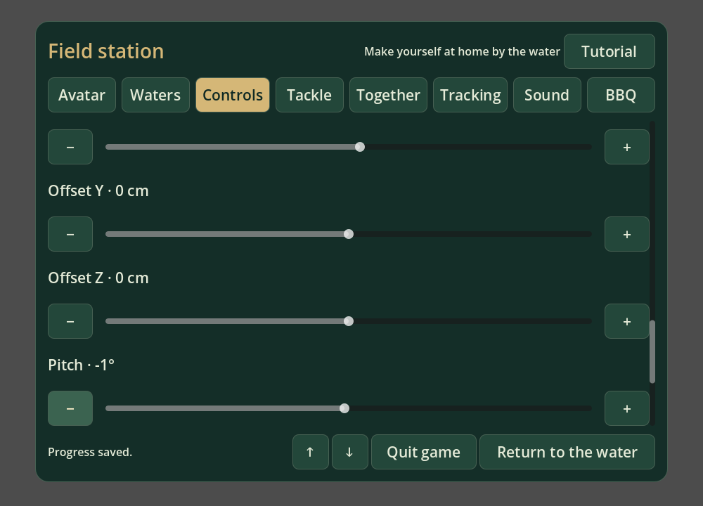
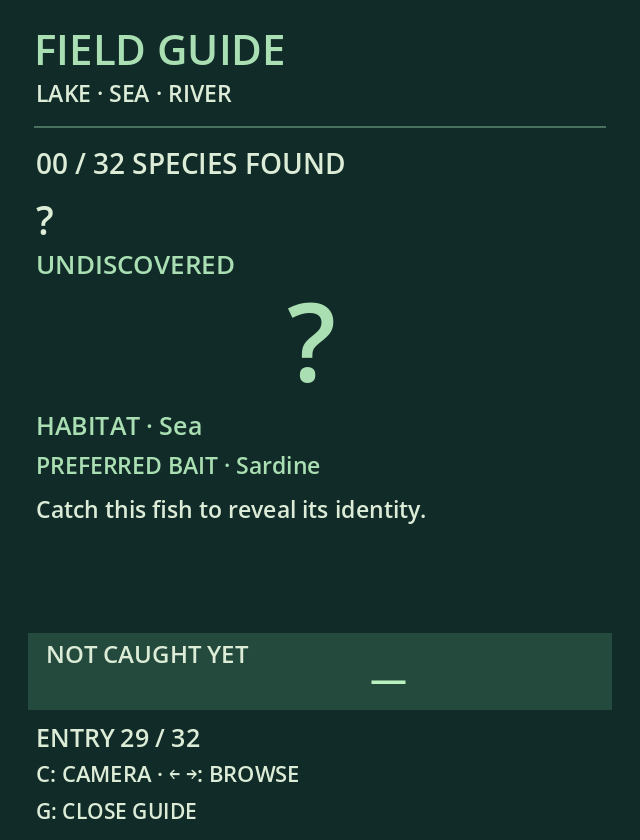

# Casting, controller alignment and shoreline fights

VR casting defaults to the **center of the headset view**. With **Field station → Controls → Head-aimed casting** on, trigger-down locks the water target while the player swings back and forward; wrist movement and eye gaze do not steer the marker. Turn it off to use only the calibrated motion controller: the measured backswing and reversal identify the gesture, the measured forward tip travel sets heading, and peak horizontal tip speed sets distance. The marker appears after a valid swing and follows its measured destination. Looking around or holding the trigger longer does not change the result. Follow-through preserves the strongest measured forward speed instead of adding a fixed distance. The preference saves immediately and restores on restart. Desktop right-drag aiming remains available; all modes keep the 5–24 metre reach and reject blocked water.

**Field station → Controls → Controller alignment** offers independent left/right X, Y and Z offsets (±20 cm), and pitch, yaw and roll (±60°), with sliders and large minus/plus buttons. Offsets are local to each grip: X right, Y up, Z toward the player. Settings apply to tracked avatar grips, casting, rod/reel/line interaction and held items, save immediately in `user://player.cfg`, and have a reset button. Changing alignment clears cast/reel motion history so the adjustment cannot create a fishing gesture. The runtime's separate menu pointer pose remains authoritative for UI pointing.



## Fish ground boundary

`scripts/fish_water_boundary.gd` derives a spatially indexed boundary from the transformed ground, deck, hull and rock triangles, including procedural river banks and boulders. Vegetation and decoration do not define swimming space. Submerged slopes are clipped at a conservative deepest-body envelope; sufficiently deep seabed remains valid water above it. A horizontal body radius also keeps the complete fish clear during turns and twitching. The resulting shallow-ground footprint blocks entry at every dive height.

A separate water-surface footprint validates aim; the larger underwater fish envelope never masks shallow water. Cast rays ignore invisible player-only barriers, and the old global Z cutoffs have been removed. All nine feeding centres per location are placed outside the largest regular fish’s dive/body envelope, within the existing cast reach, with separation and a clear view. Feeding ripples, sector lookup and bite selection share those relocated centres.

Movement is swept from the previous valid position, including lateral escapes, retrieval, river current and jump trajectories, so a fast move cannot tunnel through a narrow pier. Larger predator takeovers recover to space that fits the new body. Landing distance uses the same boundary and body clearance, allowing an exhausted fish to be retrieved without moving into the ground.

At the boundary, lateral counters become an outward pull, inward rushes become warned deep pulls, and jumps are suppressed. Subsequent moves are limited to outward pulls/runs and dives until the fish leaves the edge. Existing fight patterns then resume.

## Guide discovery pages

All 40 species have stable browsable pages, even with an empty journal. Undiscovered pages show **?** for both name and icon, conceal the scientific name, description and size record, and display a Lake/Sea/River habitat plus preferred game bait, eligible methods and named waters. Rare predators list the hooked-fish encounter bait. These are gameplay discovery hints, not exhaustive ecological distributions or diet rankings. Catching the species reveals its identity, silhouette, description and personal best in the same page. Unknown pages do not increase the discovered count or create journal records.



[Revealed entry](guide_discovered.png).

## Verification

`tests/fishing_comfort.gd` covers head aim independent of wrist rotation, frozen cast targets, per-hand calibration persistence/reset, hidden guide identities, whole-body swept collision, restrictions on both regular and predator fights, and valid retrieval at every location. Existing simulation, fight-pattern, predator, jumping, fly-fishing, synthetic tracked-cast, cast-direction/tolerance, shoreline-retrieval, fish-position, fly-control, rod-attachment/holster, avatar-tracking, guide/camera and menu suites also pass. The menu test uses actual pointer presses after scrolling to the new settings and reset button. Guide and controls screenshots were rendered in Godot and inspected.

```sh
XDG_DATA_HOME=/tmp/fishing-comfort godot --headless --path . --xr-mode off --script res://tests/fishing_comfort.gd
```

Physical controller alignment, headset comfort and headset performance still require testing on hardware. The native stereo guide suite was not rerun; headless tests and synthetic controller input do not establish those hardware properties.

## Aim restoration and Secluded Cove water check

The head-aimed gesture retains its travel/speed tolerances (`fly_fishing.gd`) and rod animation (`rod_visual.gd`). Completed swings no longer depend on a wrist-angle or release-timing gate. Level/upward head aim projects to the 24 m far target rather than failing to intersect the water. Controller alignment still applies to grip poses, with identity defaults. Frozen targets, required back/forward swings, trigger release, desktop backswing, fly extensions and 5–24 metre reach remain in place.

The cove’s panorama protection previously reduced front-water animation to a small photographic blend. A local cove coverage region now renders the actual water across the playable mouth while fading into the distant photograph and preserving opaque shore geometry. Missing background depth no longer participates in the shallow-sand fade.

`tests/aim_water_grid.gd` validates all 90 relocated sector centres across ten locations, head targeting, cast acceptance, consistent bite/ripple coordinates, shallow-water aim and side water beyond the former world-Z cutoff. `tests/secluded_water.gd` renders standing, seated and shore-edge views and measures front-water coverage with a diagnostic material, including where no opaque depth exists beneath the water. [Updated cove view](secluded_water_fixed.png).

Validation: 742 aim/grid checks across all ten locations, 1,733 comfort/boundary checks and 278 simulation checks pass, along with tracked casting, cast tolerance/direction, desktop casting update, fly controls, population, coastal travel, shoreline retrieval and fish-position suites. The original shader produces a 0.486 red channel in the diagnostic front-water pixel; the corrected shader produces 1.0 under the same capture setup. Standing, seated and shore-edge renders were inspected. These checks used synthetic tracking and real Vulkan rendering; physical headset ergonomics were not retested.

Release validation on 16 September 2026 also exercised live WiVRn head/controller tracking and captured both stereo eyes at 72 FPS. A normal headset play session was then launched without the BBQ prototype. The full native guide interaction suite was not rerun. OpenXR reported teardown warnings after the stereo probe; rendering and tracking passed. Boundary-clipped vertical jumps now retain a nonsingular fish orientation.
