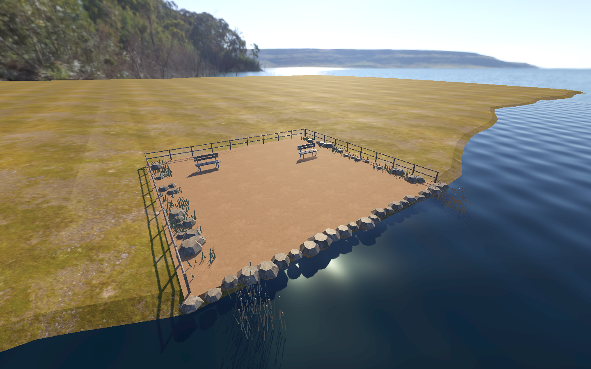
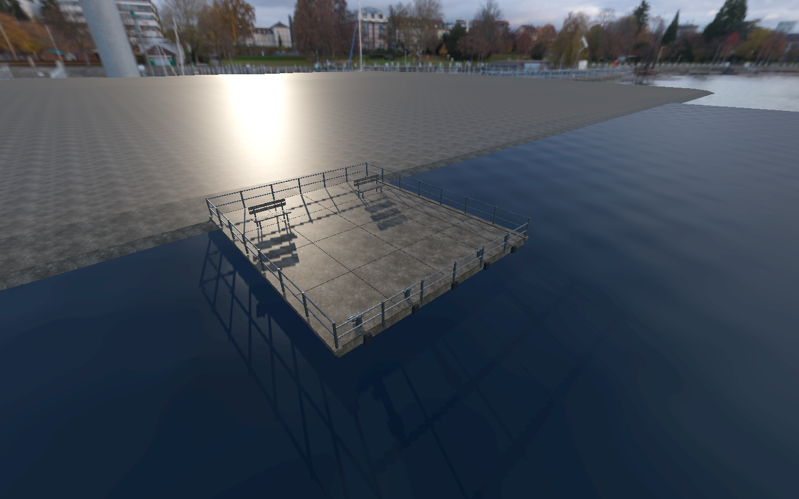
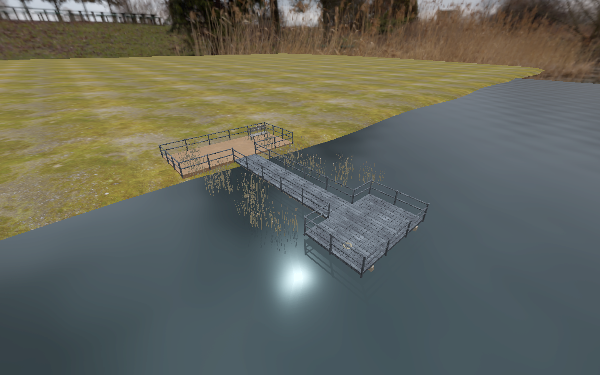
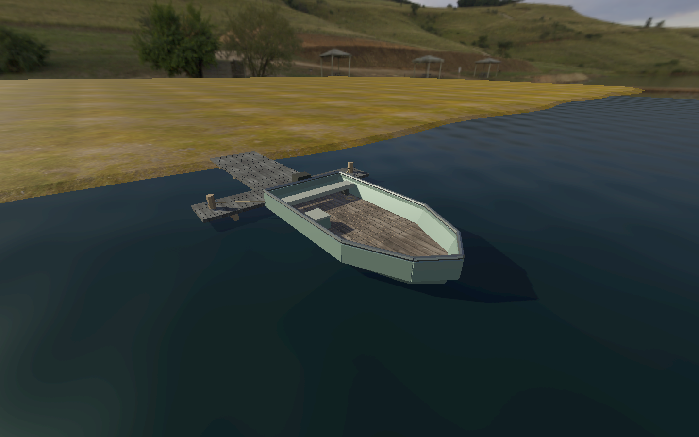

# Location foregrounds

Each playable location loads a distinct Blender-authored GLB with photographed PBR surfaces and matching lightweight collision. The cove and reed bank extend into continuous sloped mainland; the quay joins a broad harbour apron; the boat is moored to a landing stage that reaches the bank. Terrain extends beyond the water plane behind the protected play area, removing the floating-platform appearance. These are artistic layouts matched to the photographs, not surveyed reconstructions.

| Location | Walkable model | Triangles | Material batches | GLB MiB |
|---|---|---:|---:|---:|
| lakeside | 16 × 15.4 m gravel cove, rocks and benches | 7,332 | 8 | 9.72 |
| lake_pier | 10 × 12 m concrete quay, rails and mooring posts | 3,944 | 5 | 3.83 |
| gray_pier | 1.8 × 10 m boardwalk, 4.8 × 3 m fishing platform and bank | 11,868 | 8 | 8.48 |
| bell_park_pier | 3.1 × 6.2 m tapered boat, stern seat and tackle box | 3,719 | 9 | 4.75 |

The boat is stationary for VR comfort. The land beyond perimeter rails is visual scenery; locomotion remains within protected floors. The boat’s dock is a visual mooring connection, not a boarding interaction. Floor and obstacle proxies use boxes; the boat floor uses a convex hull matching its tapered bow. Travel replaces mesh and collision together, places the head’s floor projection at the new safe arrival, preserves head height/orientation, and resets movement velocity. Fall recovery uses that location’s arrival.

## Runtime renders









## Sources and rebuilding

Authored geometry, UVs and collision: `tools/build_foregrounds.py`. Blender source scenes: `source/foregrounds.blend`. Runtime models and collision/spawn metadata: `assets/models/locations/`. Original 1K PBR maps and weathered-timber derivative: `source/textures/foreground/`. Poly Haven source credits and CC0 licenses are in [foreground_sources.json](locations/foreground_sources.json) and [asset credits](../ASSET_CREDITS.md).

Rebuild with Blender’s Python interpreter:

```bash
blender --background --python tools/build_foregrounds.py
./run.sh --desktop --headless --editor --import --quit
```

Blender MCP was used to procure textures and execute this builder. Meshes are batched by material, UVs use metre-scaled repetition, and textures are embedded in GLBs. Normal Godot play does not require Blender. Future export presets must include `assets/models/locations/manifest.json` as a non-resource file.

## Validation

```bash
XDG_DATA_HOME=/tmp/fishing-foregrounds ./run.sh --desktop --headless --script res://tests/foregrounds.gd
XDG_DATA_HOME=/tmp/fishing-foreground-captures ./run.sh --desktop --script res://tests/foregrounds.gd -- --capture
```

The suite walks the player to each water edge, checks collision holds, verifies arrival floors and model replacement, tests travel from the far shore into the boat, checks the tapered bow, and tests current-location fall recovery. Native stereo/controller coverage uses `tests/locations_xr.gd`. See [validation results](VALIDATION.md).
