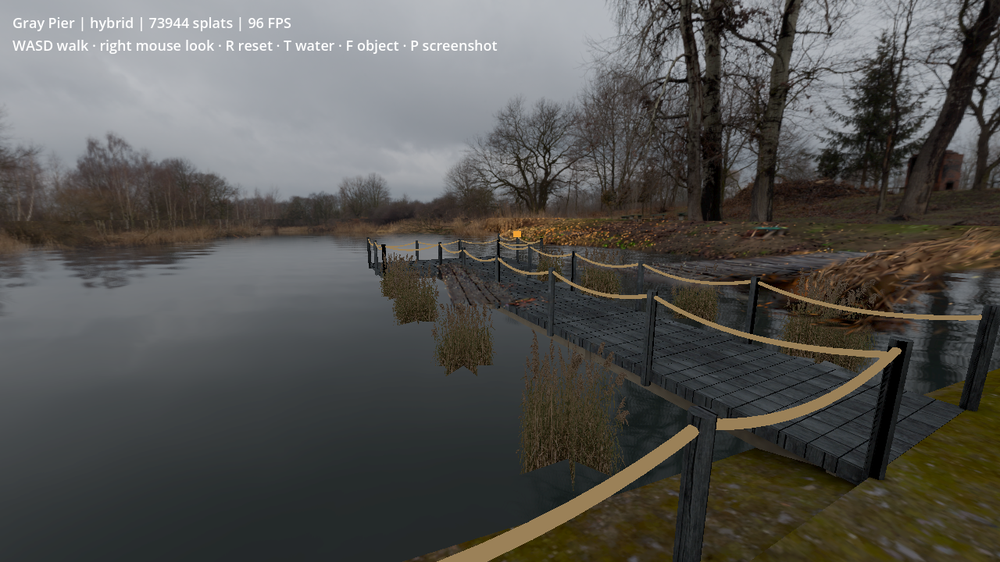
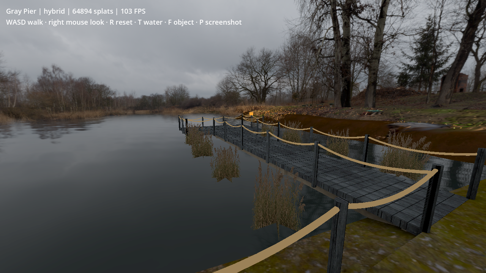
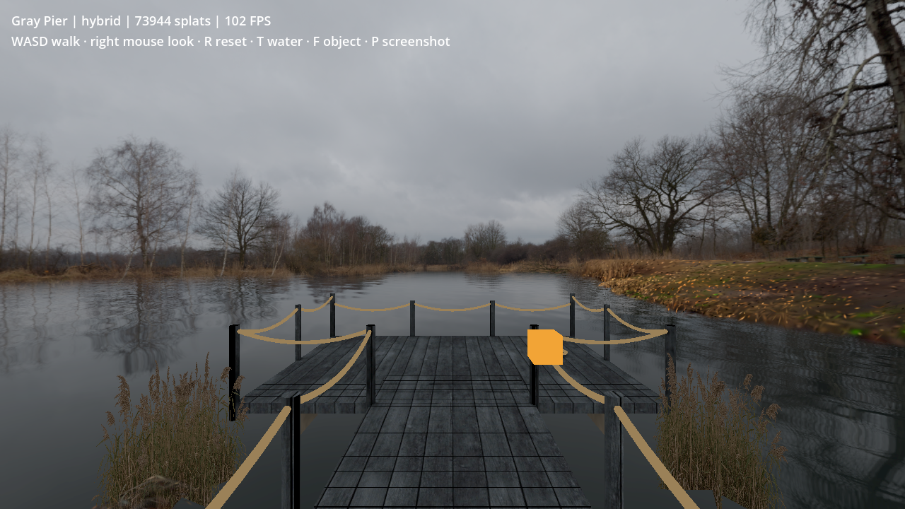
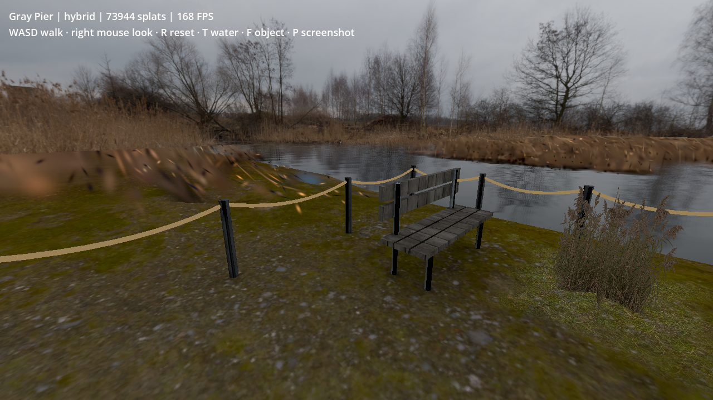
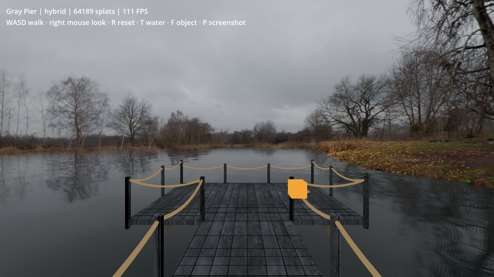
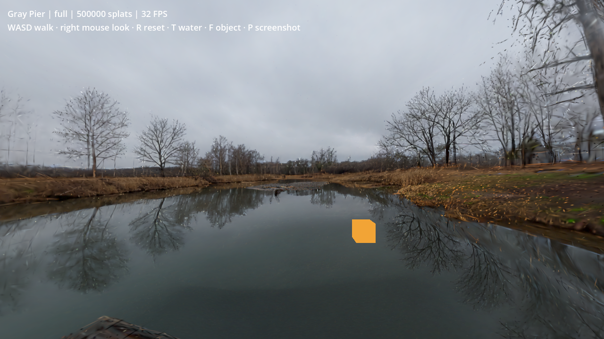
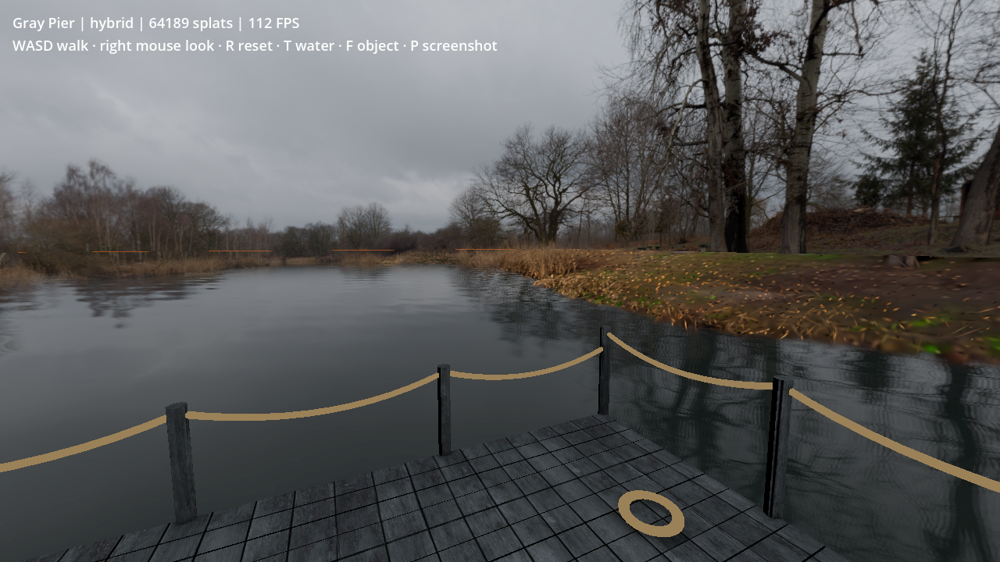

# Gray Pier hybrid environment test — 16 September 2026

Current revision: [seven-view artifact review and visual corrections](GAUSSIAN_SPLAT_VISUAL_REVIEW.md). The viewer now retains 53,204 splats; the earlier measurements below are historical.

## Detached scenery correction (previous revision)

The user's saved side-view screenshot exposed a detached generated dock/bank strip beside the authored walkway. Hiding the splat layer confirmed its source. The previous screenshot key overwrote one fixed file, so only the latest user capture was retained; it is preserved below. **P now writes unique timestamped PNG files and JSON camera poses**, allowing future views to be reproduced.

A scene-specific low open-water corridor removes the generated boardwalk fragments outside the authored floor. It removes 12,328 points at that filtering stage. At the same time, right-bank points are retained down to the waterline, avoiding the earlier blanket height cutoff that removed part of their supporting bank. A small 816-triangle terrain skirt under the right bank joins the retained scenery to the shader water. Its X range starts at 5.25 m, beyond the widest walkable floor's 4.5 m edge, and adds no gameplay collision.

The final asset contains **64,894 splats**, with zero checked walkable-support intersections and zero points remaining in the defined low-water corridor. The existing bench/ropes, 12 cutout reeds and four ground-cover patches remain. Only the water reeds have their bases extended 18 cm downward while preserving their tips, plus a shader waterline clip and bottom alpha taper; dry-bank plants are unchanged.

The final 600-frame desktop run measured **8.405 ms median / 10.662 ms p95 frame interval (~119 FPS)** and 6.986 ms median GPU time. Floor, barrier, decoration-count and protected-terrain checks passed, and the benchmark log completed without Godot errors. [Measurements and checks](splats/detached_fix_metrics.json).

The reported strip is removed and the visible right-bank gap is grounded. Coarse splat detail and the mesh/splat material transition still need art refinement; this does not establish that every possible detached fragment elsewhere has been removed. Earlier revisions and their measurements follow.

---

## Refined walkable boundary (previous revision)

The current viewer uses **73,944 splats** and the actual three floor footprints from the location manifest, replacing the original circular exclusion. The entire vertical column above/below each footprint is excluded. Filtering accounts for each Gaussian's largest axis: a conservative 4.25-sigma support bound (covering a 3-sigma raster quad diagonal) plus 15 cm clearance. Opacity fades across the following 60 cm outside that boundary. Outside the protected footprint, splats may overlap the terrain apron; nearby scenery previously lost to the circular mask is restored. This is a world-space exclusion, not a screen-space silhouette mask.

Validation found **zero support-bound overlaps** and a minimum retained clearance of **18.54 cm**. The rear dry-bank region can retain low splats down to the waterline. The original open-water cleanup remains in place.

The dock retains its bench, ropes and other mesh details. The test now also calls the existing shore-detail generator: **12 photographic reed cutouts and four soft ground-cover patches**. The complete rear floor and its half-metre border are protected from terrain edits. Beyond that border, 1,656 bank vertices form an irregular slope into the water on the front/sides, with a connected mainland strip behind the rear fence. Outside-only material tinting helps the apron meet the brown bank splats. No protected terrain vertices were moved, and the 15 collision proxies are unchanged.

The same 600-frame desktop benchmark measured **8.94 ms median / 11.38 ms p95 frame interval**, approximately **112 FPS**, with **7.49 ms median GPU time** and **153.0 MB** reported render memory. It is about 3.5× faster than the previously measured full 500k scene; the slight cost increase over the first hybrid buys additional nearby splats and restored decoration. These are individual desktop runs, not headset results.

All three floor rays and the side-barrier sweep passed. The final Godot launch and benchmark log were clean. [Refinement measurements and boundary/decorations checks](splats/refined_metrics.json). Both MCP connections were restored for preparation and visual inspection.

The coarse generated bank still shows soft/stretched splats outside the fence and some photographic shoreline mismatch. This refinement protects the playable space and restores its detail; it does not make the generated exterior uniformly sharp or establish VR readiness. The original experiment below is retained as the earlier comparison, with its earlier point count and timings.

---

The proposed combination works and substantially improves desktop performance: **8.20 ms median frame interval versus 31.36 ms for the complete 500k splat scene (3.82× faster)**. It provides a solid, walkable dock, animated water, photographic distant scenery, and retained three-dimensional nearby vegetation/bank detail. This remains an isolated experiment; it has not replaced a main-game location or been tested in VR.

## What changed

Starting from the existing 500,000-point Marble export, Blender's NumPy removed almost-transparent points, distant scenery, low water/reflections, oversized splats, the immediate mesh replacement area, and raised fragments inside a scene-specific central open-water sector. There was no new generation, API charge, or random downsampling. The original export remains intact.

| Sequential cleanup | Points removed | Points remaining |
|---|---:|---:|
| Invalid / opacity below 0.06 | 172,937 | 327,063 |
| Outside nearby scenery volume | 99,432 | 227,631 |
| Water/reflections below height cutoff | 91,980 | 135,651 |
| Oversized splats | 2,636 | 133,015 |
| Immediate authored walkway area | 33,167 | 99,848 |
| Raised fragments in central open water | 33,690 | 66,158 |
| Nearly invisible points after edge fades | 1,969 | **64,189** |

This removes **87.16%** of the original points. The resulting PLY is 3.60 MB versus approximately 28 MB for the original 500k PLY. The viewer also releases an unused duplicate float array after loading; the raster backend uses its byte data and positions. This optimization is applied to both full and cleaned comparison modes.

The hybrid combines:

- Nearby splats at their original retained density, with opacity fades across source radii 2.4–3 and 9–12. The outer radius is approximately 26.8 m after eye-height calibration.
- A 150 m radius panorama sphere using the existing 4096 × 2048 tone-mapped source image. Distant branches avoid splat breakup.
- The game's animated water shader, using the same panorama and orientation for reflection and distant blending. Splatted water is removed using a height cutoff plus the central open-water mask.
- The previously generated Gray Pier GLB, its baked lighting maps, and 15 existing collision proxies. Coarse reeds, old floating seed heads and the distant mesh bank are removed/hidden. A photographic blending pass softens the remaining near-bank transition.

The source-to-metre scale is 2.235, derived from the recorded ground estimate and a 1.63 m eye height. It is an alignment estimate, not surveyed physical scale. The mesh dock is shifted to the source camera; it replaces the generated dock instead of trusting the rough Marble collider.

## Matched desktop benchmark

Godot 4.7.2, Mobile/Vulkan, GDGS Raster, Intel Graphics ADL-N, 1280 × 720, mono, VSync requested off. Each run uses 120 warmup frames and 600 sampled frames, the same sinusoidal camera translation/yaw, and the same orange opaque test object. The inspection game was stopped during measurement. Screenshots are captured after sampling. These are individual runs, not confidence intervals; desktop/compositor activity can affect them.

| Scene | Splats | Median frame interval | p95 interval | Median GPU time | p95 GPU time | Render memory |
|---|---:|---:|---:|---:|---:|---:|
| Full original splats | 500,000 | 31.36 ms (~32 FPS) | 33.80 ms | 26.80 ms | 27.35 ms | 171.5 MB |
| **Cleaned hybrid** | **64,189** | **8.20 ms (~122 FPS)** | **10.57 ms** | **6.67 ms** | **7.49 ms** | **138.5 MB** |
| Panorama + mesh + water | 0 | 4.12 ms (~243 FPS) | 6.27 ms | 3.36 ms | 3.69 ms | 128.3 MB |

[Raw measurements and checks](splats/hybrid_metrics.json). Frame intervals use wall-clock timestamps; GPU values use Godot's viewport GPU timer. FPS values are reciprocals of median intervals, not average FPS. Memory is Godot's reported render-resource allocation in decimal MB, not peak process RSS or total shared GPU usage. Static engine memory was 185.0 / 69.3 / 49.6 MB respectively. The prior experiment unnecessarily loaded an 8K HDR texture; its older memory figures are not directly comparable to these runs.

The hybrid reduces median frame interval by 73.85%, GPU time by 75.11%, and reported render memory by 19.23% relative to full splats. It costs approximately 4.08 ms of median application frame interval, 3.31 ms GPU time and 10.2 MB render memory over the panorama-only scenery configuration. These are end-to-end scene comparisons, not isolated renderer microbenchmarks. Full mode has generated water/dock rather than the replacement mesh and shader water.

## Visual and collision checks

The hybrid visibly improves the solid deck and rail edges and removes the original speckled central water fragments. Nearby trees/bank retain parallax when the camera translates; the panorama-only variant is cheaper but cannot provide that local depth.

Godot physics checks hit the walkway, front platform and rear bank floor at Y = −1.63 m. A capsule swept four metres sideways was blocked after approximately 0.60 m by the side barrier. Interactive inspection confirmed the walker remains grounded at both the starting position and four metres along the dock. These checks cover representative positions, not every possible edge or VR locomotion case.

The final PLY passed finite-value, radius, height, scale, minimum-opacity and empty-central-water-sector checks. Both SPZ converter tests passed. All final benchmark logs completed without Godot errors; the final MCP launch also reported no current-run errors.

## Remaining limitations and decision

- The filters are tailored to this lake. A height cutoff also removes low land, and a central angular mask assumes open water. Different locations need their own masks or semantic editing.
- The source panorama still contains foreground objects. Looking sideways/backwards can reveal photographed rail/dock remnants and hard joins around the authored bank; some small splat streaks remain.
- Generated and photographed scenery do not agree everywhere. Translating away from the capture position can reveal doubled branches, shoreline disagreement and differences between the splat surface and water reflection. The shader uses panorama-based reflections, not reflections of the current splat geometry.
- The finite panorama sphere provides approximate distant depth. Its fixed location, source foreground imagery and source-unit calibration need stereo/head-motion validation.
- This test excludes the full game, avatars, fishing simulation, networking and headset rendering. Desktop ~122 FPS does not establish a 72/90 Hz standalone VR budget.

**Use the hybrid as the next headset prototype, retaining panorama + mesh + water as the lower-cost fallback.** The measured benefit over the full splat export is substantial; whether the nearby splats justify their extra cost over the fallback needs stereo inspection and a target-device benchmark.

Run `./tools/splat_experiment/run.sh` for the prepared hybrid. See [controls and reproduction](../tools/splat_experiment/README.md). All large/private generated assets remain in the ignored `test-results/splat-experiment/` directory.
