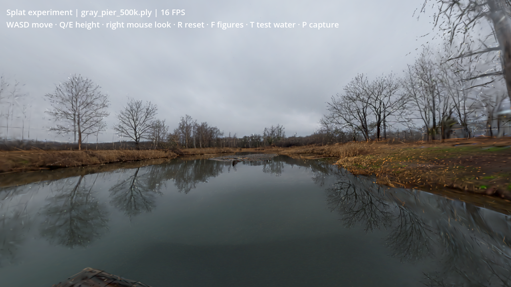
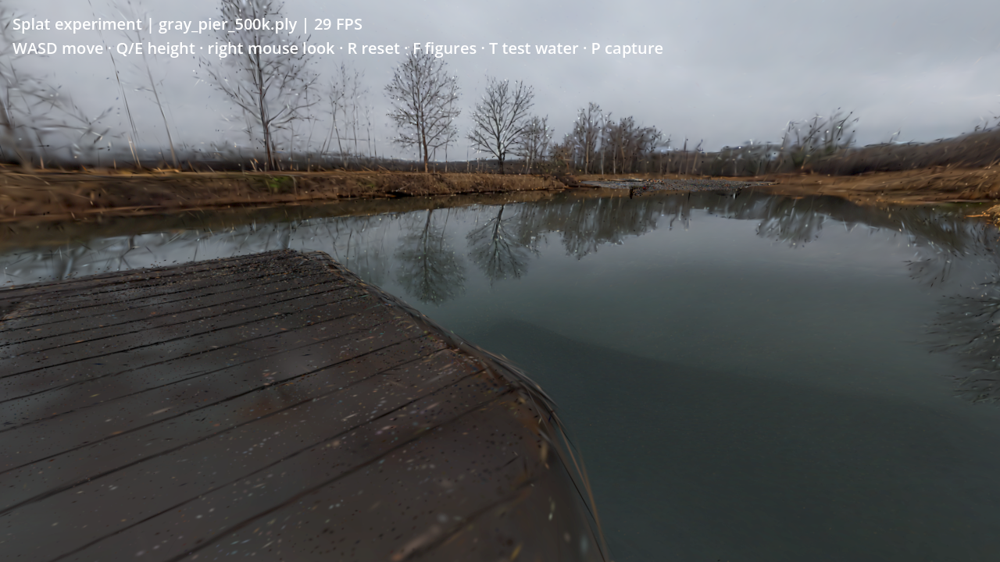

# Gray Pier Gaussian splat test — 16 September 2026

**Generation and desktop Godot rendering work. The result is promising for a controlled scenery experiment, but needs optimization and cleanup before replacing a game location.**

Generated one private Marble 1.1 environment from our existing Gray Pier panorama. Source: [Gray Pier by Sergey Rudavin, Poly Haven](https://polyhaven.com/a/gray_pier), CC0. Blender 5.2.1 prepared a 4096 × 2048 AgX PNG from the retained 8K HDR. World Labs returned the completed generation in approximately 4 minutes 53 seconds, charging 1,500 credits ($1.20 at the published API rate). There was one paid generation, with no paid retries.

World ID: `bdfd6c27-0c1a-4c81-b89e-5ada320866d2`. Generation used `marble-1.1`, seed `20260916`, panorama input, private visibility. [API pricing](https://docs.worldlabs.ai/api/pricing).

## Results

The 500k version preserves the lake, wooden dock and banks convincingly from the starting position. Translating the camera exposes actual scene depth; it is not a panorama wrapped around the camera. Branches and thin edges still break into visible splats. The 100k version has conspicuous streaks and blotchy detail and is unsuitable as a direct visual replacement.

Tested in an isolated Godot 4.7.2 project using Mobile/Vulkan and the GDGS Raster backend, revision `c22024b33a24e06d8629c654825fabd0485b2dba`. Blender MCP inspected the generated collision GLB; Godot MCP launched and inspected the actual splat scene, changed viewpoints, swapped quality levels and captured screenshots. The main game was not changed.

## Desktop measurements

Intel Graphics ADL-N, 1280 × 720, mono, requested VSync off. Each timed run warms up for 120 frames and samples 600 process-frame deltas while translating and rotating the camera. The desktop compositor and other host activity can still affect timings. These are observed application frame intervals, not isolated GPU timings or headset results.

| Variant | Actual splats | SPZ download | Median frame interval | 95th percentile | Godot reported render memory |
|---|---:|---:|---:|---:|---:|
| 100k | 98,304 | 1.40 MB | 16.67 ms (~60 FPS) | 19.07 ms | 311.8 MB |
| 500k | 500,000 | 8.04 MB | 30.00 ms (~33 FPS) | 31.25 ms | 373.3 MB |

[Recorded metrics](splats/desktop_metrics.json). Memory includes the loaded 8K HDR water panorama, viewport and test content; it is not splat-only memory or measured peak process RSS. Timings include simple opaque rod/fish/box proxies, with the water surface hidden. Resource-read times (76/178 ms) exclude subsequent backend initialization, texture preparation and editor import.

The 500k run was repeated with the inspection game stopped to avoid concurrent rendering affecting the result. No Quest, Pico or stereoscopic OpenXR benchmark was performed. The full game, avatars, multiplayer and Field Guide viewport were not included.

## Integration findings

- **Coordinate correction is required.** The raw API output rendered upside down when treated as default SPZ/OpenGL coordinates. Applying Marble's documented Y/Z flip corrected it. GDGS also recenters the points on import, so the viewer restores the transformed centroid to preserve the source camera location. [Marble export specifications](https://docs.worldlabs.ai/marble/export/specs).
- **Animated water can render alongside splats.** The actual game shader was copied into the isolated viewer and inspected with opaque test objects. The simple plane produces an obvious reflection mismatch and a rough shoreline join. It has not replaced or removed all generated static water/reflections. A production scene needs water-region editing, calibrated placement and reflection alignment. [Water experiment capture](splats/generated_500k_game_water.png).
- **Collision export is usable as reference, not ready gameplay geometry.** Blender imported 82,089 vertices and 147,229 triangles. The inspected surface has rough regions and gaps. Walkable areas, protected water edges and scale need authored validation.
- **Small SPZ does not mean small runtime assets.** The importer produced roughly 48.4 MB and 246.0 MB uncompressed resource files for the 100k and 500k variants, respectively. Both exports have degree-0 color, but the current importer allocates its full coefficient layout. Runtime packing/import optimization deserves investigation.
- **Import must finish before launch.** Starting immediately after a filesystem scan raced the PLY import. Waiting for completed imports resolved the missing-resource error; final launches and benchmark logs were clean.

## Retained outputs and next step

All four generated SPZ variants (100k, 150k, 500k, full resolution), the collider, panorama, input image, private API metadata, PLY conversions and runnable viewer are under `test-results/splat-experiment/`. The full-resolution SPZ is 30.87 MB; it was downloaded but not rendered. The 150k variant was downloaded but not benchmarked.

Launch with `./tools/splat_experiment/run.sh`. [Controls and reproduction](../tools/splat_experiment/README.md).

Follow-up completed: see [the hybrid cleanup and benchmark](GAUSSIAN_SPLAT_HYBRID.md).

Original proposed next experiment: crop and optimize the 500k scene around one fishing position, remove its static water region, retain authored near-field collision, and test stereo on the target headset before integrating it into the location menu. The present desktop results do not establish a 72/90 Hz standalone VR budget.
