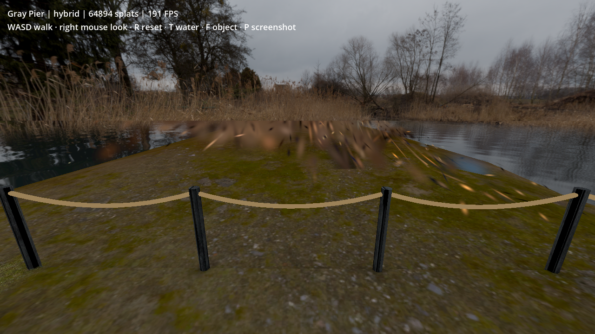
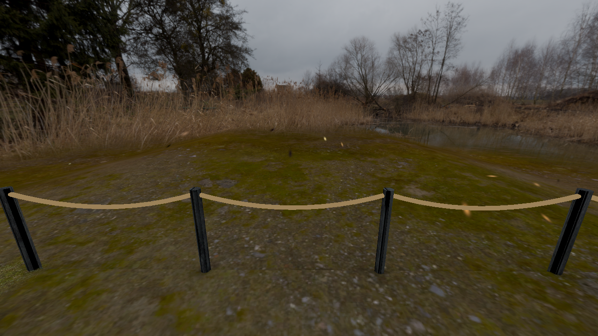
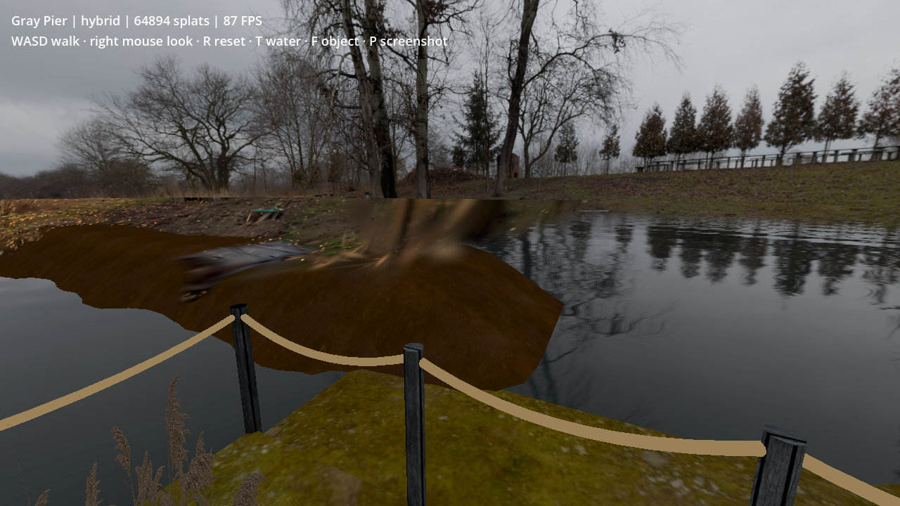
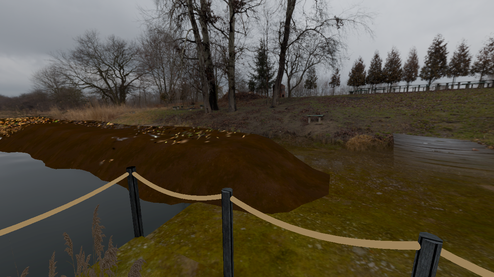
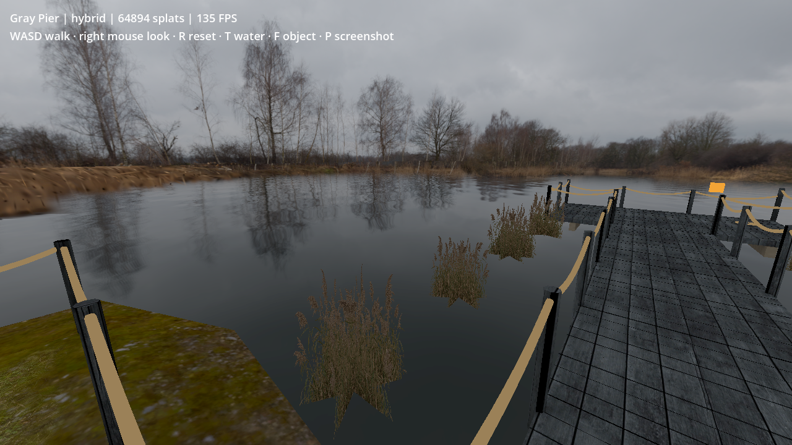
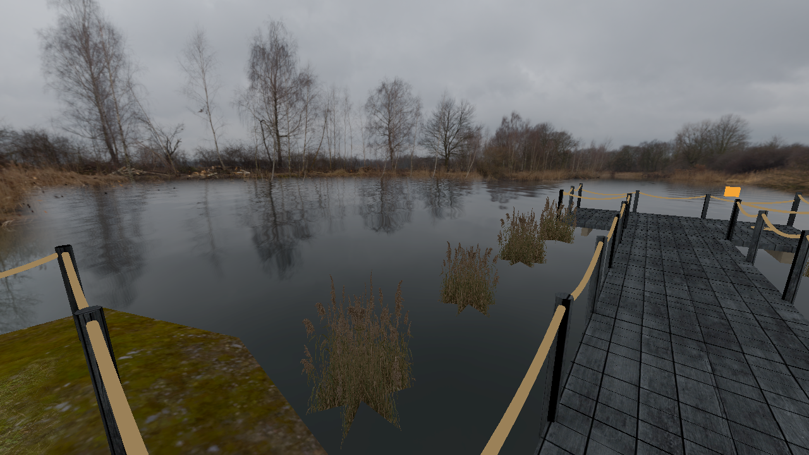

# Seven-view visual cleanup

Reviewed all seven new user captures and replayed their saved camera positions after the changes. This pass prioritizes appearance; the previously accepted performance was not used as a reason to reduce detail. No new benchmark claim is made, and screenshot capture stalls are not frame-rate measurements.

## Changes

- **Water/land overlap:** the broad water plane crossed dry banks. Hiding it at the saved right-bank viewpoint removed the sharp horizontal breakup. The experimental water shader now clips outside the lake's rear/right boundaries, blends its edge color to the same finite panorama sphere, and renders as an opaque surface. Opaque depth avoids transparent surface sorting artifacts. The standalone test has no underwater-fish window; the main game's water shader is unchanged.
- **Stretched ground patches:** below world Y = 0.5 m, reject splats with a source major-axis sigma of 0.025 or greater. This removes large projected ground smears while retaining finer low scenery and the separate taller-scenery limits. The resulting asset contains **53,204 splats**. These are scene-specific visual thresholds, not a general segmentation algorithm.
- **Rear connection:** bring the dry-land transition forward outside the protected floor border so the right/rear terrain no longer forms isolated strips. Walking surfaces and their half-metre protected border remain unchanged.
- **Outer mesh edge:** blend distant bank color into the finite panorama over X distances 9–18 m and rear Z distances 17–29 m in dock coordinates. The foreground material and decorations remain intact. Re-enabling the old distant mesh produced a conspicuous flat extension, so it remains hidden.

## Matched views

### Rear fence: stretched ground patches

Before:

After:

### Right bank: horizontal cut and disconnected surface

Before:

After:

### Lake-facing view

Before:

After:

## Validation and remaining work

All seven `review_*.png` files and their source `inspection_hybrid_*.json` camera poses remain in `test-results/splat-experiment/viewer/`. The replay hides the HUD during capture so capture-induced FPS fluctuations are not confused with rendering performance.

The final launch reported no current-run Godot errors. All three floor rays and the side barrier sweep passed. The scene retains 15 collision proxies, 12 reed cutouts and four ground-cover patches, with zero changed protected terrain vertices. The filtered PLY still has zero checked walkable-support intersections and zero points in the detached low-water corridor. [Recorded checks](splats/visual_review_checks.json).

The major stretched patches and water-induced horizontal cuts are reduced. The result is still an art prototype: the brown supporting bank differs visibly from the photographed terrain, scattered low splat streaks remain, the crossed reed cards can read as flat from some angles, and panoramic depth remains approximate. The distant terrain color blend intentionally gives up local parallax at its outermost edge. These limitations are visible in the retained comparisons; this pass does not claim that every artifact is resolved.

Run `./tools/splat_experiment/run.sh`. The main game remains unchanged.
