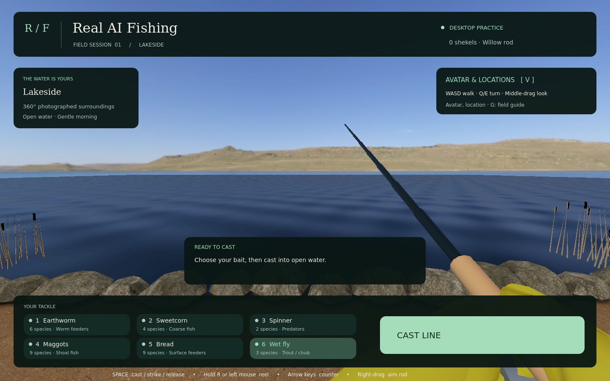
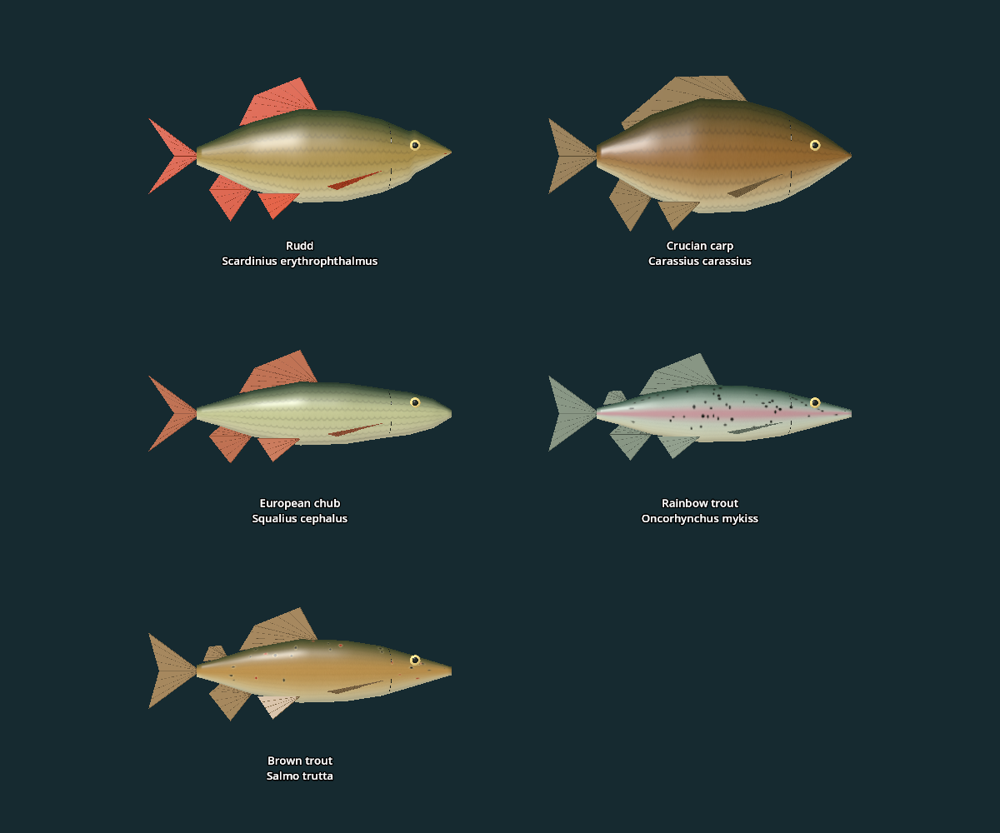
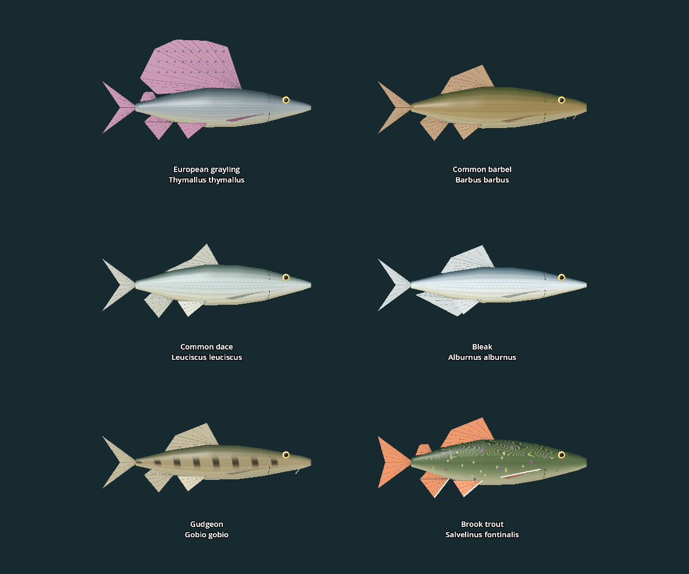

# Location species and bait

Each location has fourteen distinct catchable real species. Eighteen species exist in total. Casting intersects the selected location roster with the bait pool, then samples with inverse rarity weights (1, ½, ⅓). Shared species retain the same identity, model and Field Guide record across locations. The rosters are authored gameplay, not claims about native species or stocking at the photographed sites.

| Species | Lakeside | Lake Pier | Gray Pier | Bell Park |
|---|:---:|:---:|:---:|:---:|
| European perch | ✓ | ✓ | ✓ | ✓ |
| Common carp | ✓ | ✓ | ✓ | ✓ |
| Northern pike | ✓ | ✓ | ✓ | ✓ |
| Common roach | ✓ | ✓ | ✓ | ✓ |
| Tench | ✓ | — | ✓ | ✓ |
| Common bream | ✓ | ✓ | ✓ | ✓ |
| Zander | ✓ | ✓ | ✓ | — |
| Rudd | ✓ | ✓ | ✓ | — |
| Crucian carp | ✓ | — | ✓ | ✓ |
| European chub | ✓ | ✓ | — | ✓ |
| Rainbow trout | — | ✓ | — | ✓ |
| Brown trout | — | ✓ | ✓ | ✓ |
| European grayling | — | ✓ | ✓ | — |
| Common barbel | ✓ | — | ✓ | ✓ |
| Common dace | ✓ | ✓ | — | ✓ |
| Bleak | ✓ | ✓ | ✓ | — |
| Gudgeon | ✓ | — | ✓ | ✓ |
| Brook trout | — | ✓ | — | ✓ |
| **Total** | **14** | **14** | **14** | **14** |

## Six bait choices

Use keys **1–6**, the six desktop tiles, or **left X** in VR to cycle. Selection is locked during a cast. The HUD reports the number of compatible species at the current location. All six choices have at least one local target everywhere. These are simplified game bait affinities; wet flies use the existing casting mechanics, not a separate fly-fishing simulation.

| Bait | Compatible catalogue species, before location filtering |
|---|---|
| Earthworm | Perch, roach, rudd, chub, barbel, gudgeon |
| Sweetcorn | Carp, tench, bream, crucian carp |
| Spinner | Pike, zander, rainbow trout, brown trout, brook trout |
| Maggots | Perch, roach, bream, rudd, chub, grayling, barbel, dace, bleak, gudgeon |
| Bread | Carp, roach, tench, rudd, crucian carp, chub, barbel, dace, bleak |
| Wet fly | Chub, rainbow trout, brown trout, grayling, dace, bleak, brook trout |

## Five new models

Original Blender-authored geometry and 1024 × 512 procedural skin textures, with distinct proportions, dorsal/tail fins, eyes, scale patterns and trout markings. Salmonids include adipose fins; the rainbow trout has a pink flank stripe, and brown trout has dark/red spots with pale halos. These are simplified game models, not scans. No external artwork was copied. Geometry is joined into one mesh per fish with material surfaces; GLBs embed their skin textures and use a one-metre reference length along +X.

The original procedural assets described here have been superseded: current source is `tools/build_photographic_fish.py` and `source/photographic_fish.blend`. Rebuild with Blender Python or Blender MCP. Field Guide descriptions and original silhouettes cover all twelve species. Existing journal identities and first seven catalogue indices remain unchanged.

Biological references checked 14 September 2026:

- [Rudd — Fisheries and Oceans Canada](https://www.dfo-mpo.gc.ca/species-especes/profiles-profils/rudd-gardonrouge-eng.html).
- [Crucian carp — FishBase](https://www.fishbase.se/summary/Carassius-carassius.html).
- [European chub — FishBase](https://www.fishbase.se/summary/Leuciscus-cephalus.html).
- [Rainbow trout — Maryland DNR](https://dnr.maryland.gov/fisheries/Pages/fish-facts.aspx?fishname=rainbow+trout).
- [Brown trout — California Department of Fish and Wildlife](https://wildlife.ca.gov/fishing/inland/brown-trout).

Validation: `tests/location_species.gd` samples normal cast transitions for every location/bait pair, checks every local species is reachable, and exercises keyboard, mouse and VR input handlers. `tests/fish_species.gd` checks all models and saved records. Native tracked-controller cycling is covered by `tests/catch_xr.gd`.

## Eighteen-species expansion

Six further real species bring each existing location from ten to fourteen catches. All six existing baits remain usable at every location. Original catalogue indices 0–11 are preserved; additions use 12–17, so old catch identities and guide records stay intact. New catches use the existing length/weight variation, rarity payouts, species endurance, upgraded rod fatigue and counter recovery. The guide includes a description and distinct silhouette for each addition, and network validation accepts their catch indices.

| New species | Typical length / weight | Rarity | Stamina | Reference |
|---|---|---:|---:|---|
| European grayling — *Thymallus thymallus* | 35 cm / 0.55 kg | 2 | 105 | [Canal & River Trust](https://canalrivertrust.org.uk/things-to-do/fishing/caring-for-our-fish/freshwater-fish-species/grayling) |
| Common barbel — *Barbus barbus* | 60 cm / 2.5 kg | 3 | 155 | [Canal & River Trust](https://canalrivertrust.org.uk/things-to-do/fishing/caring-for-our-fish/freshwater-fish-species/barbel) |
| Common dace — *Leuciscus leuciscus* | 22 cm / 0.13 kg | 1 | 55 | [Inland Fisheries Ireland](https://www.fisheriesireland.ie/fish-species/dace-leuciscus-leucisus) |
| Bleak — *Alburnus alburnus* | 17 cm / 0.04 kg | 1 | 45 | [FishBase](https://www.fishbase.se/summary/Alburnus-alburnus.html) |
| Gudgeon — *Gobio gobio* | 15 cm / 0.035 kg | 1 | 50 | [Inland Fisheries Ireland](https://www.fisheriesireland.ie/fish-species/gudgeon-gobio-gobio) |
| Brook trout — *Salvelinus fontinalis* | 32 cm / 0.45 kg | 3 | 110 | [Maryland DNR](https://dnr.maryland.gov/fisheries/pages/fish-facts.aspx?fishname=brook+trout) |

Biological identities and identifying traits were checked against these references on 14 September 2026. The models are original Blender geometry with authored procedural skin textures: rounded species-specific snouts, scales, eyes, fins/rays, grayling dorsal sail and adipose fin, barbel's four mouth barbels, gudgeon's two barbels and flank blotches, dace's concave dorsal edge, bleak's long anal fin, and brook trout's vermiculations, spots and white lower fin margins. They are simplified game models, not scans. Location membership, rarity, reference sizes and endurance are authored gameplay values.

These original procedural assets have been superseded by `tools/build_photographic_fish.py` and `source/photographic_fish.blend`; current runtime GLBs use photographic-style textures. Source/asset license is CC0; no reference photographs were copied. `expanded_fish_assets.json` records sizes, triangle counts, hashes and references.

Validation: fishing simulation166, tackle81, model integration113, location/bait77, field guide33 and network guards27 passed. Rendered location/gallery run79 passed; all six models were visually inspected. Full fights land all 18 species with starter and top-tier rods, and upgraded rods shorten every species' fight. Existing Godot exit cleanup warnings remain. Physical headset inspection was not repeated for this asset expansion.
