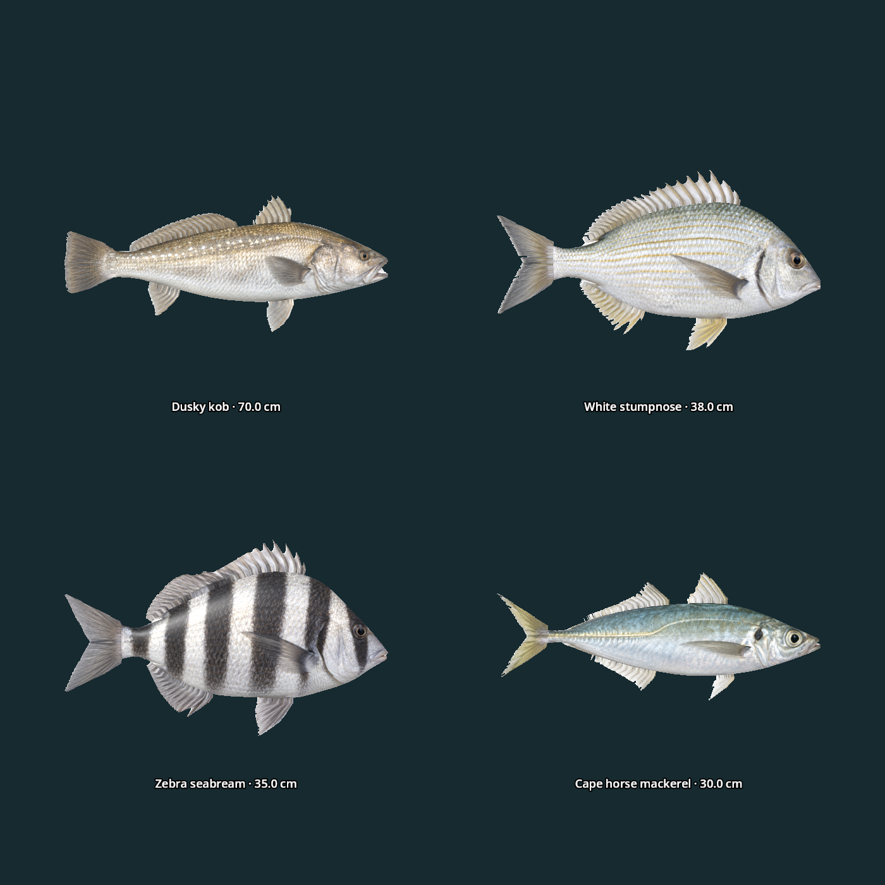

# Additional maritime species

Four new regular catches expand the coastal catalogue from eight to twelve species. Each of the four coastal locations now offers nine regular targets, with distinct rosters and at least two spinner targets. Freshwater and river rosters are unchanged. Existing journal indices, including rare predators at 26–27, are preserved; the additions occupy 28–31.

| Species | Game reference size | Fight style | Available bait |
| --- | --- | --- | --- |
| Dusky kob — *Argyrosomus japonicus* | 70 cm / 3.2 kg | Strong, sustained cruiser | Squid, spinner, sardine, saltwater fly |
| White stumpnose — *Rhabdosargus globiceps* | 38 cm / 0.95 kg | Bottom pulls | Ragworm, squid, prawn |
| Zebra seabream — *Diplodus hottentotus* | 35 cm / 0.85 kg | Reef resistance | Ragworm, squid, prawn |
| Cape horse mackerel — *Trachurus capensis* | 30 cm / 0.28 kg | Quick darts | Squid, spinner, sardine, saltwater fly |

Sizes, rarity, fight tuning and bait pools are gameplay choices. Horse mackerel is also eligible prey for the existing bronze whaler encounter. All four species have textured 3D catch models, authored guide silhouettes and descriptions, record persistence, rewards and individual fight profiles.

## Coastal selection

| Location | Nine regular species |
| --- | --- |
| Coastal Rocks | Blacktail, galjoen, hottentot, red roman, elf, Cape yellowtail, dusky kob, zebra seabream, Cape horse mackerel |
| Sunrise Beach | Blacktail, galjoen, white steenbras, elf, Cape yellowtail, harder mullet, dusky kob, white stumpnose, Cape horse mackerel |
| Secluded Cove | Blacktail, galjoen, hottentot, red roman, elf, harder mullet, white stumpnose, zebra seabream, Cape horse mackerel |
| Tidal Strand | Blacktail, hottentot, white steenbras, elf, Cape yellowtail, harder mullet, dusky kob, white stumpnose, Cape horse mackerel |

## References and original artwork

Species identities, habitat and identifying features were researched using:

- [ORI dusky kob fact sheet](https://saambr.org.za/wp-content/uploads/2023/03/ORI-Fish-Fact-Sheet-Dusky-Kob.pdf): coastal and estuarine occurrence, elongated body, rounded tail and pearly lateral markings.
- [SANBI white stumpnose assessment](https://speciesstatus.sanbi.org/taxa/detail/02941/): southern African shallow reef and sand habitat.
- [SANBI zebra seabream assessment](https://speciesstatus.sanbi.org/taxa/detail/2957/): rocky coastal habitat and benthic invertebrate diet.
- [European Commission Cape horse mackerel taxonomy](https://fish-commercial-names.ec.europa.eu/fish-names/species/trachurus-capensis_en) and [FAO regional fisheries account](https://www.fao.org/4/x6014e/x6014e04.htm): species identity and southern African occurrence.

The photographic-style reference images are original **built-in OpenAI imagegen** outputs, not downloaded source photographs. Anatomy and markings remain artistic approximations. [Exact prompts and saved reference paths](marine_expansion_prompts.json) and [asset SHA-256 manifest](marine_expansion_assets.json) are retained.

- Generated references and reviewed anatomy: `source/fish_references/marine_expansion/`.
- Generated albedo and baked normals: `source/textures/fish/marine_expansion/`.
- Packed editable Blender source: `source/marine_expansion.blend`.
- Runtime models: `assets/models/fish/dusky_kob.glb`, `white_stumpnose.glb`, `zebra_seabream.glb`, `cape_horse_mackerel.glb`.
- Rebuild: `blender --background --python tools/build_marine_expansion.py`.

The existing reconstruction pipeline produces volumetric bodies, inset eyes, paired pectoral fins, attached external fins and normal maps. Models use the existing metre-based catch scaling and twitch animation.

## Runtime previews and validation



[Oblique model views](marine_expansion-oblique.png). Gallery lengths are normalized for shape comparison; labels show reference catch lengths. Actual catches use their recorded size.

Passed: simulation 278 checks, location/bait 244, model integration 221, guide 47 and tackle 123. Coastal travel and bait switching, predator encounters and network guards reported no failures. Fight-pattern tests land every regular species at three fixed seeds and check unique patterns. Blender fin and silhouette validation passed for all 29 reconstructed species. Both rendered model views were visually inspected. Physical headset appearance and performance were not retested.

Reproduce the focused runtime check with:

```sh
XDG_DATA_HOME=/tmp/maritime-check godot --headless --path . --xr-mode off --script res://tests/marine_species.gd
```

For the rendered gallery, omit `--headless` and append `-- --expansion-capture`. Run `tools/validate_fish_fins.py` through Blender for the geometry audit.
